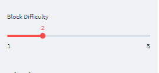
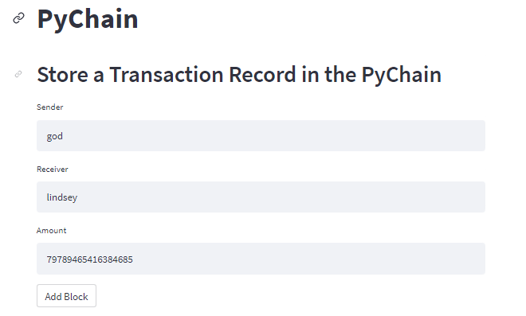
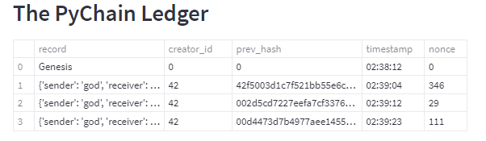
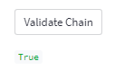
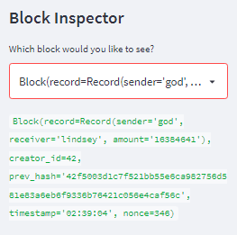

# PyChain_ledger

This blockchain based application allows users to conduct financial transactions via Streamlit, a user-friendly interface. Additionally, it allows users to verify the integrity of the data in the ledger.
---

## Technologies

This application utilizes the following technologies:

**[Pandas Library Python](https://pandas.pydata.org/)** 

**[Streamlit Library Python](https://streamlit.io/)** 

**Dataclasses Library Python** 

**Typing Library Python**

**Datetime Library Python** 

**Hashlib Library Python**


---

## Installation Guide

```python
pip install streamlit
```
```python
pip install pandas
```

---

## Usage

To use the application, clone the repository and run the **pychain.py** file in streamlit with the following code:

```python
streamlit run pychain.py
```

The user can then:
    1) adjust the difficulty of the block hashing, 



    2) enter sender, receiver and amount inputs, 



    3) view the resulting ledger, 



    4) validate the chain, 



    5) and use the "Block Inspector" to view individual blocks. 




The below image shows the complete interface:


---

 
## Contributors

**Contributor:** Lindsey Hardouin<br>
**Email Address:** lindseyhardouin@gmail.com<br>