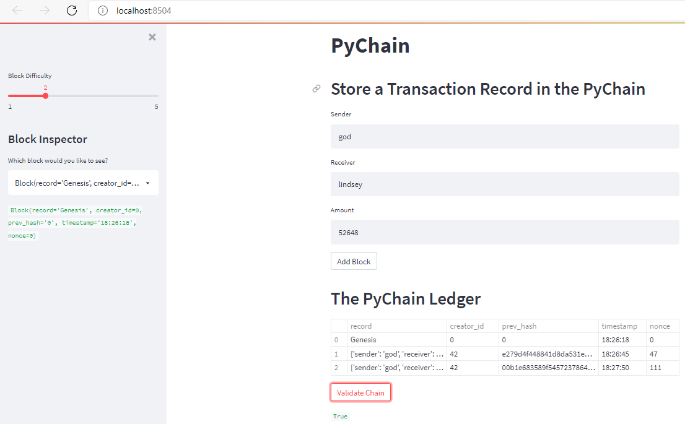

# PyChain_ledger

This blockchain based application allows users to conduct financial transactions via Streamlit, a user-friendly interface. Additionally, it allows users to verify the integrity of the data in the ledger.
---

## Technologies

This project leverages python 3.7. It utilizes the following packages:

**[Pandas Library Python](https://pandas.pydata.org/)** - a fast, powerful, flexible and easy to use open source data analysis and manipulation tool.<br>

**[Streamlit Library Python](https://streamlit.io/)** -  turns data scripts into shareable web apps in minutes.<br>

**Dataclasses Library Python** - provides a decorator and functions for automatically adding generated special methods such as __init__() and __repr__() to user-defined classes. <br>

**Typing Library Python** - provides runtime support for type hints. <br>

**Datetime Library Python** - supplies classes for manipulating dates and times.<br>

**Hashlib Library Python** - implements a common interface to many different secure hash and message digest algorithms.<br>


---

## Installation Guide

Before running the application, install the following dependencies:

1) To install the Streamlit library, confirm your dev virtual environment is active, and then run the following command:

```python
pip install streamlit
```

---

## Usage

To use the application, clone the repository and run the **pychain.py** file in streamlit with the following code:

```python
streamlit run pychain.py
```

The user can then 
    adjust the difficulty of the block hashing, 
    enter sender, receiver and amount inputs, 
    view the resulting ledger, 
    validate the chain, 
    and use the "Block Inspector" to view individual blocks. 
As the image belows shows:



 
---

 
## Contributors

**Contributor:** Lindsey Hardouin<br>
**Email Address:** lindseyhardouin@gmail.com<br>